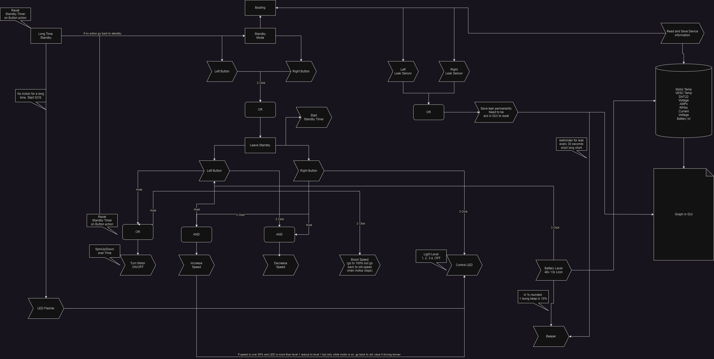

# TODO

- **Siren:** Signaling device (possibly beep through motor or blinking through front lamp).
- **Web interface:** Retrieve basic information and adjust settings if necessary.
- **Battery warning:** Low battery beep. Every 10% rounded down. From 30% remaining.
- **Energy Saver:** 20% - Reduce power to a maximum of 50% starting at X%.
- **Emergency stop:** Immediately stop in case of sudden increase in current or drop in rotation speed (hand in rotor).
- **Update via WiFi**
- **Device must function even in case of water ingress. However, there must be a signal to alert the user.**
- **Light at Level 1 if speed exceeds 80% to prevent battery overload. Light off at 100% power. Then revert to original value.**
- **Implement click codes according to the table**

# Click Codes

| Switch 1 | Switch 2 | Function |
|:--------:|:--------:|:--------:|
| Hold     | Hold     | Turn motor ON |
| Hold     |          | Turn motor ON |
|          | Hold     | Turn motor ON |
| 1 Click  | 1 Click  |           |
|          | 1 Click  |           |
| 2 Clicks | 2 Clicks | Boost Mode |
| 2 Clicks |          | Reactivate |
|          | 2 Clicks | Reactivate |
| 3 Clicks | 3 Clicks |           |
| 3 Clicks |          | Battery level |
|          | 3 Clicks | Light Level 1, 2, 3, 4, OFF |
| 2 Clicks | Hold     | Stepwise slower |
| Hold     | 2 Clicks | Stepwise faster |

# Logic

# GUI

# Pinout

# Build Process

