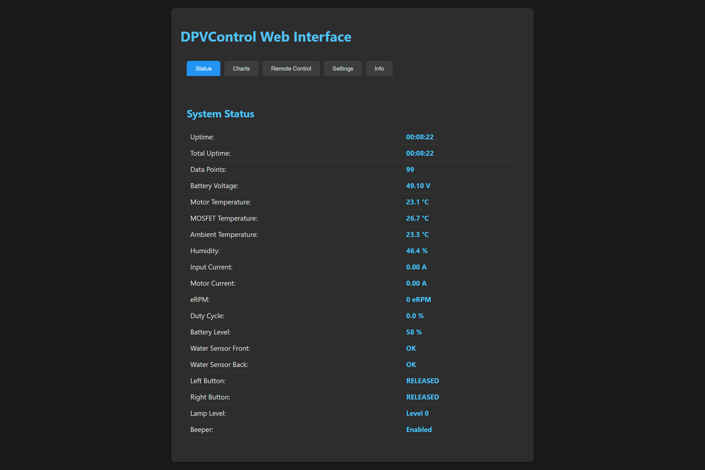
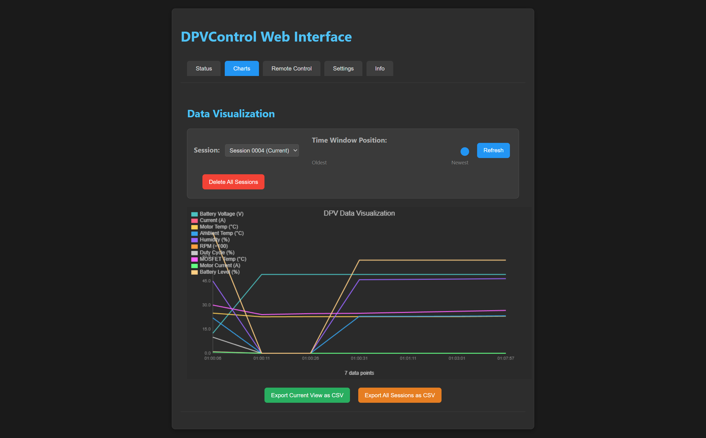
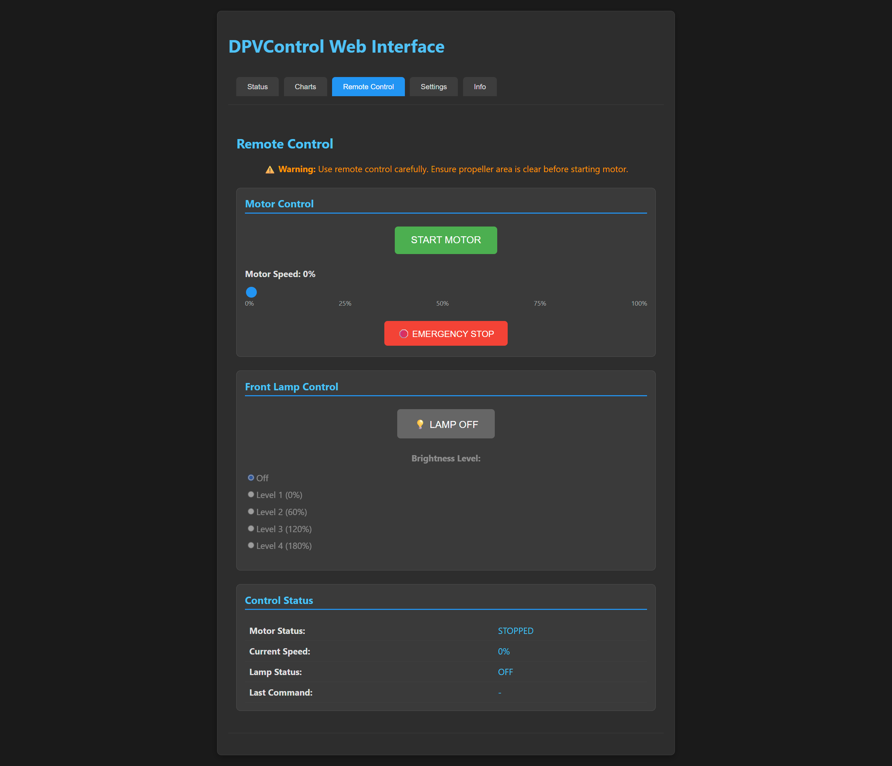
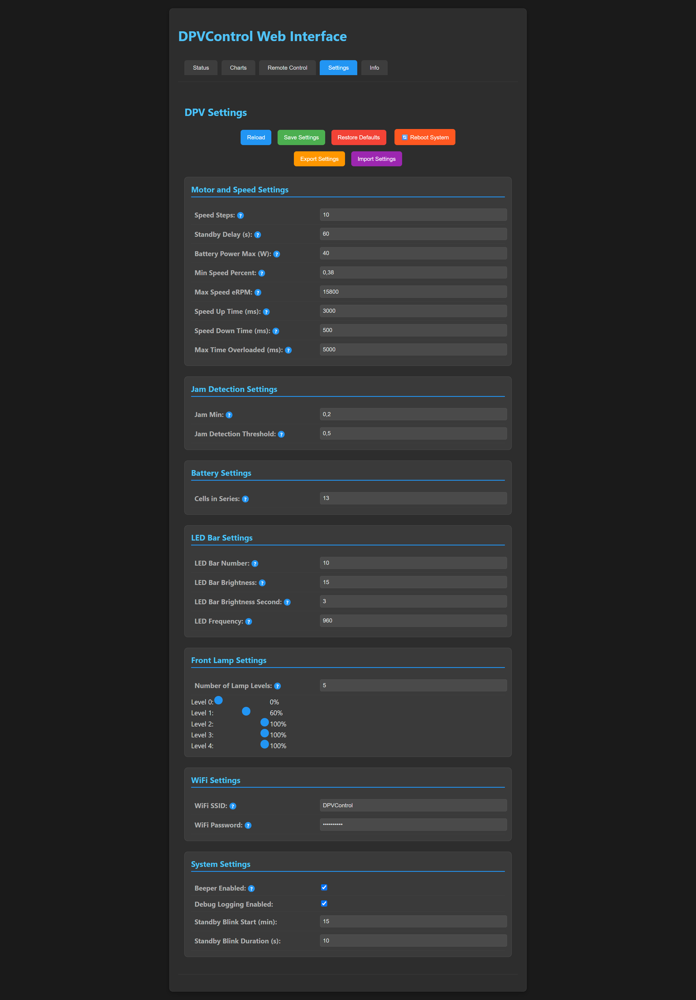
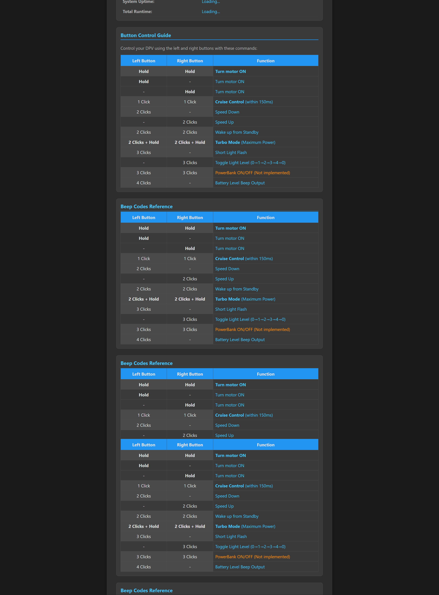

[](https://github.com/BubTec/DPVControl/actions/workflows/cpp-lint.yml)

# THE PROJECT
In this GitHub project, the aim is to build and operate a DPV (Dive Propulsion Vehicle) using standard components. In my case, I will breathe new life into an old Aquazepp. The motor I'm using is a common 2000-watt scooter motor, controlled by a VESC (Vedder Electronic Speed Controller). The entire system is controlled through Reed switches activated by magnets with a Bowden cable.

See the full build process in my [blog](https://3o0.de/gu0).


I would greatly appreciate support for my project. Every $ contributes to enhancing the project.

<a href="https://www.paypal.com/cgi-bin/webscr?cmd=_s-xclick&hosted_button_id=6ZFSVPZWLLAMC">
  
</a>


# Development

## PlatformIO with VS Code
This project uses **PlatformIO** for development, which provides better dependency management and build system compared to the Arduino IDE.

### Setup Instructions

1. **Install VS Code**: Download from [code.visualstudio.com](https://code.visualstudio.com/)

2. **Install PlatformIO Extension**: 
   - Open VS Code
   - Go to Extensions (Ctrl+Shift+X)
   - Search for "PlatformIO IDE" and install it

3. **Open Project**:
   - Clone this repository
   - Open the project folder in VS Code
   - PlatformIO will automatically detect the `platformio.ini` file

4. **Build and Upload**:
   - Use the PlatformIO toolbar at the bottom of VS Code
   - Click "Build" (✓) to compile
   - Click "Upload" (→) to flash to ESP32
   - Click "Serial Monitor" to view debug output

### Pre-commit Hook for Automated Testing

To ensure code quality, a pre-commit hook is provided that automatically runs all tests before each commit. This prevents commits if any test fails.

**Installation:**
1. Make sure the file `pre-commit.ps1` is located in the project root (it is versioned).
2. In the `.git/hooks/` directory, create a file named `pre-commit.bat` with the following content:
   ```bat
   @echo off
   REM pre-commit hook: runs all PlatformIO tests and prevents commit on failure
   echo Running all tests before commit...
   python -m platformio test -e native
   if errorlevel 1 (
       echo.
       echo ERROR: Some tests failed. Commit aborted!
       exit /b 1
   )
   echo All tests passed. Commit allowed.
   exit /b 0
   ```
3. From now on, all tests will be run automatically before each commit. The commit will be aborted if any test fails.

> **Note:**
> The pre-commit hook only works if you commit from the terminal (CMD). Many GUIs like GitHub Desktop or VSCode-Git do not execute local hooks or do not support batch/shell scripts as hooks.

### Dependencies
All required libraries are automatically managed through `platformio.ini`:
- ArduinoJson, ESP32Servo, OneWire, DallasTemperature
- DHT sensor library, FastLED, Adafruit NeoPixel
- VescUart, ClickButton, Uptime Library

No manual library installation required!

### Makefile Usage

For a quick command-line workflow, a `Makefile` is provided.  The most common
tasks can be run with:

```bash
make install   # install PlatformIO and Python dependencies
make test      # run unit tests
make build     # build the firmware
make upload    # upload firmware to the ESP32
```

Use `make` without arguments to list all available targets.


# API Documentation

The DPV Control system provides a comprehensive REST API for system monitoring, data retrieval, and configuration management.

📖 **[View API Specification](./api-specification.yaml)** - Complete OpenAPI 3.0 documentation

**Quick Links:**
- **Interactive Documentation:** Open `api-specification.yaml` in [Swagger Editor](https://editor.swagger.io/) or VS Code with OpenAPI extension
- **Base URL:** `http://4.3.2.1` (when connected to DPV WiFi)
- **Format:** JSON REST API

**Available Endpoints:**
- `GET /api/status` - Real-time system status and sensor readings
- `GET /api/data` - Historical sensor data with filtering options
- `GET /api/trip-log` - Complete trip log download
- `GET /api/settings` - Current device configuration
- `POST /api/settings` - Update device settings
- `POST /api/settings/restore` - Restore default settings

**Features:**
- Real-time monitoring of all sensor data
- Historical data retrieval with configurable time ranges
- Complete settings management with validation
- Trip log export functionality
- Session-based data filtering


# Click Codes

| Switch 1 | Switch 2 | Function |
|:--------:|:--------:|:--------:|
| Hold     | Hold     | Turn motor ON |
| Hold     |          | Turn motor ON |
|          | Hold     | Turn motor ON |
| 1 Click  | 1 Click  |  cruise control |
| 1 Click  |          |           |
|          | 1 Click  |           |
| 2 Clicks | 2 Clicks | Boost Mode |
| 2 Clicks |          | Reactivate |
|          | 2 Clicks | Reactivate |
| 2 Clicks | 	      | Stepwise slower |
|          | 2 Clicks | Stepwise faster |
| 3 Clicks | 3 Clicks | PowerBank ON/OFF|
| 3 Clicks |          | Short light flash |
|          | 3 Clicks | Light Level 1, 2, 3, 4, OFF |
| 4 Clicks | 4 Clicks | reverse drive mode |
| 4 Clicks |          | beep Battery level |
|          | 4 Clicks |  |

# Beep Codes
1 = short beep
2= long beep
| Beep | Function | 
|:--------:|:--------:|
| 12121212 | Leak warning |
|1|still in standby|
|11|going to standby or wake up from standby|
|2|10% battery left|
|22|20% battery left|
|222|30% battery left|
|n*2| Get n beep for every 10% left in battery (beep Battery level)|
|1| once after boot|
|111|No speedup because overloaded|
|1|speed steps exeeded|
|12|Overloaded for too long. Lowering speed.|
|21|No longer overloaded|
|111222111|SOS - Long time without any action. The lamp is also activated with the same code|

# Pinout


# Logic


# GUI






# Hardware Updates
| Change                                        |
|-----------------------------------------------|
| Handle replaced with POM tube                 |
| Caveline replaced by thin V4A steel cable    |
| Stator integrated to eliminate lateral torque|
| Tow/haul line attached at the top            |
| Impact protection fitted over the magnetic switches|


# Videos
[](https://youtu.be/6myfqZKiGTU "Aquazepp first ride")
[](https://youtube.com/shorts/ZGKomkWQHeM "Aquazepp Stator")
[](https://www.youtube.com/watch?v=6m43nQFAH6o "Full speed drive")


# Build Process


 
