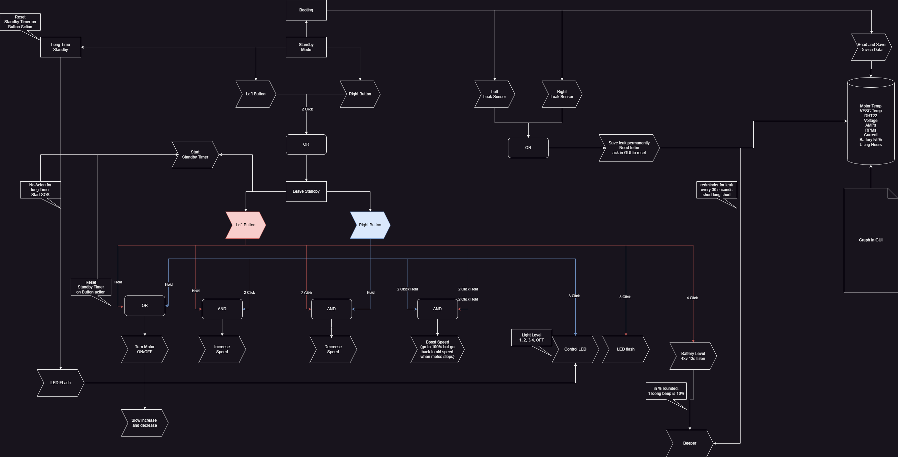

# THE PROJECT
In this GitHub project, the aim is to build and operate a DPV (Dive Propulsion Vehicle) using standard components. In my case, I will breathe new life into an old Aquazepp. The motor I'm using is a common 2000-watt scooter motor, controlled by a VESC (Vedder Electronic Speed Controller). The entire system is controlled through Reed switches activated by magnets with a Bowden cable.

I would greatly appreciate support for my project. Every $ contributes to enhancing the project.

# Development

## VSCode
We switched from using the Arduino IDE to VS Code. 

Install Arduino extension from microsoft.

Then install the [Arduino CLI](https://downloads.arduino.cc/arduino-cli/arduino-cli_latest_Windows_64bit.msi) and select it in vscode or just copy template files. You only need to click ".\\.vscode_template\copy_it.bat" to do that.
Install the libraries that we use from inside vscode using the arduino library manager. If some are missing they need to be put in **C:\Users<user>\Documents\Arduino\libraries** so that they can be found there.

Install the Arduino Plugin for vscode.

The bottom of you IDE should now looks like this:

More information about in https://github.com/n3roGit/DPVControl/issues/26. 

## Anduino IDE
We used to use the <a href="https://www.arduino.cc/en/software">Arduino IDE</a> for Development. 
Open the file **DPVControl/DPVController/DPVController.ino** to open the project. 

### Board Config
I am using a wroom esp32 board for development. 

Follow 
<a href="https://randomnerdtutorials.com/installing-the-esp32-board-in-arduino-ide-windows-instructions/">
this tutorial</a> to install the board .

You might need a <a href="https://www.silabs.com/developers/usb-to-uart-bridge-vcp-drivers?tab=downloads">windows driver</a>.

### Download Libraries

Download the .zip files for all the required Libraries (use the github-links in DPVController.ino). Place
them in the /libraries -Folder and install them into Arduino.

# TODO

- 5% - **Web interface:** Retrieve basic information and adjust settings if necessary.
- 0% - **Update via WiFi**
- 0% - **Implement watchdog to make it smooth and stable**
- 30% - **display uptime and overall runtime in gui**

# Generate Graph from Log
There is currently no GUI to display the data from the log in the GUI. We currently use the following website for this.
https://webutility.io/csv-to-chart-online
The data can be easily uploaded here. By selecting the required data points, the desired graph can be easily created.

# Click Codes

| Switch 1 | Switch 2 | Function |
|:--------:|:--------:|:--------:|
| Hold     | Hold     | Turn motor ON |
| Hold     |          | Turn motor ON |
|          | Hold     | Turn motor ON |
| 1 Click  | 1 Click  |  cruise control |
| 1 Click  |          |           |
|          | 1 Click  |           |
| 2 Clicks | 2 Clicks | Boost Mode |
| 2 Clicks |          | Reactivate |
|          | 2 Clicks | Reactivate |
| 2 Clicks | Hold     | Stepwise slower |
| Hold     | 2 Clicks | Stepwise faster |
| 3 Clicks | 3 Clicks | PowerBank ON/OFF|
| 3 Clicks |          | Short light flash |
|          | 3 Clicks | Light Level 1, 2, 3, 4, OFF |
| 4 Clicks | 4 Clicks |  |
| 4 Clicks |          | beep Battery level |
|          | 4 Clicks |  |

# Beep Codes
1 = short beep
2= long beep
| Beep | Function | 
|:--------:|:--------:|
| 12121212 | Leak warning |
|1|still in standby|
|2|going to standby or wake up from standby|
|2|10% battery left|
|22|20% battery left|
|222|30% battery left|
|n*2| Get n beep for every 10% left in battery (beep Battery level)|
|1| once after boot|
|11|No speedup because overloaded|
|1|speed steps exeeded|
|12|Overloaded for too long. Lowering speed.|
|21|No longer overloaded|
|111222111|SOS - Long time without any action. The lamp is also activated with the same code|

# Logic

# GUI

# Pinout

# Videos

# Build Process

